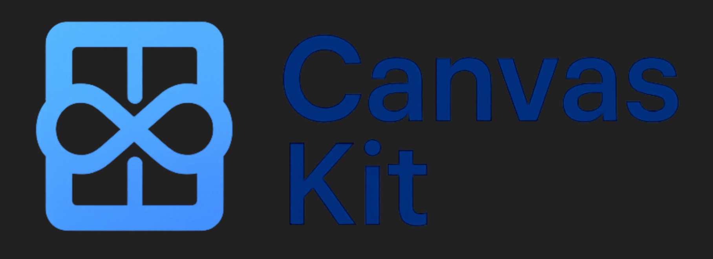

<!-- README header -->

<div align="center">
  
</div>
<div align="center">

<h1 align="center">Canvas Kit — Infinite Canvas for Flutter</h1>

<p align="center"><em>Composable infinite pan/zoom canvas for Flutter with interactive and programmatic camera control</em></p>

<p align="center">
  <a href="https://pub.dev/packages/canvas_kit">
    
  </a>
  <a href="https://github.com/vento007/canvas_kit">
    
  </a>
  <a href="https://opensource.org/licenses/MIT">
    
  </a>
  <a href="https://flutter.dev/">
    
  </a>
  
  
  
  <a href="https://github.com/vento007/canvas_kit/issues">
    
  </a>
  <a href="https://github.com/vento007/canvas_kit/pulls">
    
  </a>
  <a href="https://github.com/vento007/canvas_kit/graphs/contributors">
    
  </a>
  
  
</p>

<hr>

</div>

# Quick Demo

<div align="center">
  
</div>

# Canvas Kit User Guide

A step-by-step guide to using the `canvas_kit` package to build pan/zoom interfaces.

## What is an Canvas Kit?

An Canvas Kit is a zoomable, pannable interface where content exists in a large 2D coordinate space. Think of it like Google Maps, but for your app's content. Users can:

- **Pan** by dragging to move around the space
- **Zoom** with pinch gestures or mouse wheel to see more or less detail
- **Interact** with content at different zoom levels

**Common use cases:**
- **Node editors** - Visual programming, flowcharts, mind maps
- **Design tools** - Drawing apps, CAD software, graphic editors  
- **Data visualization** - Large graphs, network diagrams, timelines
- **Games** - Strategy games, world maps, level editors
- **Productivity** - Whiteboards, planning tools, brainstorming apps

## Why Use This Package?

** What makes it great:**
- **Drop-in solution** - Works with any Flutter widgets
- **Two interaction modes** - Automatic gestures or full control
- **World + viewport mixing** - Content that moves with zoom + fixed UI elements
- **Boundary support** - Constrain users to specific areas
- **Performance optimized** - Automatic culling and efficient rendering
- **Gesture flexibility** - Handles complex multi-touch scenarios correctly

** When you might want something else:**
- **Simple scrolling lists** - Use `ListView` or `GridView` instead
- **Fixed-size content** - Regular Flutter layouts are simpler
- **Text-heavy interfaces** - Zooming text can hurt readability
- **Touch-only simple apps** - May be overkill for basic interactions

**Compared to building your own:**
- Handles tricky gesture conflicts (pan vs zoom vs item drag)
- Solves coordinate transformation math for you
- Provides optimizations you probably wouldn't implement
- Maintains consistent behavior across platforms

---

**What you'll learn:**
1. [Getting Started](#getting-started) - Your first Canvas Kit2. [Adding Interactive Items](#adding-interactive-items) - Draggable nodes and widgets
3. [Understanding Coordinate Systems](#understanding-coordinate-systems) - World vs viewport
4. [Camera Control](#camera-control) - Programmatic navigation
5. [Setting Boundaries](#setting-boundaries) - Constraining the view
6. [Visual Layers](#visual-layers) - Backgrounds and overlays
7. [Advanced Usage](#advanced-usage) - Custom gestures and complex layouts

---

## Important Notes

- Initial release and evolving API: This is an early version of the package. The public API may evolve and include breaking changes. To avoid surprise upgrades, lock the package version in your `pubspec.yaml`.
- Platform focus: Most testing has been done on desktop and web. For the smoothest experience, validate your flows on desktop/web first, then adapt to mobile as needed.
- Issues and feedback: Please report bugs and feature requests via GitHub Issues in the repository. Include minimal repro steps and your environment (Flutter version, platform) to help us triage quickly.

---

## Getting Started

### Step 1: Basic Setup

Start with the simplest possible Canvas Kit - just a container you can pan and zoom:

```dart
import 'package:flutter/material.dart';
import 'package:canvas_kit/canvas_kit.dart';

class MyCanvasPage extends StatefulWidget {
  @override
  State<MyCanvasPage> createState() => _MyCanvasPageState();
}

class _MyCanvasPageState extends State<MyCanvasPage> {
  late final CanvasKitController _controller;

  @override
  void initState() {
    super.initState();
    _controller = CanvasKitController();
  }

  @override
  Widget build(BuildContext context) {
    return Scaffold(
      appBar: AppBar(title: const Text('My Canvas Kit')),
      body: CanvasKit(
        controller: _controller,
        children: [],
      ),
    );
  }
}
```

**What's happening:** This creates an empty Canvas Kit with automatic pan (drag) and zoom (pinch/wheel) gestures.

### Step 2: Add a Visual Background

Add a grid background so you can actually see the pan/zoom in action:

```dart
import 'package:vector_math/vector_math_64.dart' show Vector3;

class SimpleGrid extends CustomPainter {
  final Matrix4 transform;
  
  SimpleGrid(this.transform);

  @override
  void paint(Canvas canvas, Size size) {
    final paint = Paint()
      ..color = Colors.grey.withValues(alpha: 0.3)
      ..strokeWidth = 1;

    // Draw grid lines every 50 units
    for (double x = -1000; x <= 1000; x += 50) {
      final start = _worldToScreen(Offset(x, -1000));
      final end = _worldToScreen(Offset(x, 1000));
      if (start.dx >= -100 && start.dx <= size.width + 100) {
        canvas.drawLine(start, end, paint);
      }
    }
    
    for (double y = -1000; y <= 1000; y += 50) {
      final start = _worldToScreen(Offset(-1000, y));
      final end = _worldToScreen(Offset(1000, y));
      if (start.dy >= -100 && start.dy <= size.height + 100) {
        canvas.drawLine(start, end, paint);
      }
    }
  }

  Offset _worldToScreen(Offset worldPoint) {
    final vector = Vector3(worldPoint.dx, worldPoint.dy, 0);
    vector.applyMatrix4(transform);
    return Offset(vector.x, vector.y);
  }

  @override
  bool shouldRepaint(SimpleGrid old) => old.transform != transform;
}

// Use in your CanvasKit:
CanvasKit(
  controller: _controller,
  backgroundBuilder: (transform) => Container(
    color: const Color(0xFFF8F8F8), // Light gray base
    child: CustomPaint(
      painter: SimpleGrid(transform),
      size: Size.infinite,
    ),
  ),
  children: [],
)
```

**Try it:** Now when you drag and zoom, you'll see the grid lines move and scale, giving you clear visual feedback of the camera movement.

---

## Adding Interactive Items

### Step 3: Your First Canvas Item

Add some content to your canvas:

```dart
import 'package:flutter/material.dart';
import 'package:canvas_kit/canvas_kit.dart';
import 'package:vector_math/vector_math_64.dart' show Vector3;

class MyCanvasPage extends StatefulWidget {
  @override
  State<MyCanvasPage> createState() => _MyCanvasPageState();
}

class _MyCanvasPageState extends State<MyCanvasPage> {
  late final CanvasKitController _controller;
  Offset _nodePosition = const Offset(200, 150);

  @override
  void initState() {
    super.initState();
    _controller = CanvasKitController();
  }

  @override
  Widget build(BuildContext context) {
    return Scaffold(
      appBar: AppBar(title: const Text('My Canvas Kit')),
      body: CanvasKit(
        controller: _controller,
        backgroundBuilder: (transform) => Container(
          color: const Color(0xFFF8F8F8),
          child: CustomPaint(
            painter: SimpleGrid(transform),
            size: Size.infinite,
          ),
        ),
        children: [
          CanvasItem(
            id: 'my-node',
            worldPosition: _nodePosition,
            child: Container(
              width: 100,
              height: 80,
              decoration: BoxDecoration(
                color: Colors.blue,
                borderRadius: BorderRadius.circular(8),
              ),
              child: const Center(
                child: Text('Hello!', style: TextStyle(color: Colors.white)),
              ),
            ),
          ),
        ],
      ),
    );
  }
}

class SimpleGrid extends CustomPainter {
  final Matrix4 transform;
  
  SimpleGrid(this.transform);

  @override
  void paint(Canvas canvas, Size size) {
    final paint = Paint()
      ..color = Colors.grey.withValues(alpha: 0.3)
      ..strokeWidth = 1;

    for (double x = -1000; x <= 1000; x += 50) {
      final start = _worldToScreen(Offset(x, -1000));
      final end = _worldToScreen(Offset(x, 1000));
      if (start.dx >= -100 && start.dx <= size.width + 100) {
        canvas.drawLine(start, end, paint);
      }
    }
    
    for (double y = -1000; y <= 1000; y += 50) {
      final start = _worldToScreen(Offset(-1000, y));
      final end = _worldToScreen(Offset(1000, y));
      if (start.dy >= -100 && start.dy <= size.height + 100) {
        canvas.drawLine(start, end, paint);
      }
    }
  }

  Offset _worldToScreen(Offset worldPoint) {
    final vector = Vector3(worldPoint.dx, worldPoint.dy, 0);
    vector.applyMatrix4(transform);
    return Offset(vector.x, vector.y);
  }

  @override
  bool shouldRepaint(SimpleGrid old) => old.transform != transform;
}
```

**What's happening:** The `CanvasItem` places your widget at position (200, 150) in "world space" - it will move and scale with the canvas.

### Step 4: Make Items Draggable

Enable dragging by adding two properties to your existing CanvasItem:

```dart
CanvasItem(
  id: 'my-node',
  worldPosition: _nodePosition,
  draggable: true, // Enable dragging
  onWorldMoved: (newPosition) {
    setState(() {
      _nodePosition = newPosition; // Update your state
    });
  },
  child: Container(
    width: 100,
    height: 80,
    decoration: BoxDecoration(
      color: Colors.blue,
      borderRadius: BorderRadius.circular(8),
    ),
    child: const Center(
      child: Text('Hello!', style: TextStyle(color: Colors.white)),
    ),
  ),
)
```

**Try it:** Now you can drag the blue box around while still being able to pan and zoom the canvas.

### Step 5: Add Multiple Items

Update your state class to handle multiple draggable nodes:

```dart
class _MyCanvasPageState extends State<MyCanvasPage> {
  late final CanvasKitController _controller;
  Offset _node1Position = const Offset(100, 100);
  Offset _node2Position = const Offset(300, 200);

  @override
  void initState() {
    super.initState();
    _controller = CanvasKitController();
  }

  @override
  Widget build(BuildContext context) {
    return Scaffold(
      appBar: AppBar(title: const Text('My Canvas Kit')),
      body: CanvasKit(
        controller: _controller,
        backgroundBuilder: (transform) => Container(
          color: const Color(0xFFF8F8F8),
          child: CustomPaint(
            painter: SimpleGrid(transform),
            size: Size.infinite,
          ),
        ),
        children: [
          CanvasItem(
            id: 'node-1', 
            worldPosition: _node1Position,
            draggable: true,
            onWorldMoved: (pos) => setState(() => _node1Position = pos),
            child: _buildNode('Node 1', Colors.blue),
          ),
          CanvasItem(
            id: 'node-2', 
            worldPosition: _node2Position,
            draggable: true,
            onWorldMoved: (pos) => setState(() => _node2Position = pos),
            child: _buildNode('Node 2', Colors.green),
          ),
        ],
      ),
    );
  }

  Widget _buildNode(String text, Color color) {
    return Container(
      width: 100,
      height: 80,
      decoration: BoxDecoration(
        color: color,
        borderRadius: BorderRadius.circular(8),
      ),
      child: Center(
        child: Text(text, style: const TextStyle(color: Colors.white)),
      ),
    );
  }
}
```

---

## Understanding Coordinate Systems

### World Space vs Viewport Space

- **World space**: Your content's logical coordinates (like a map or game world)
- **Viewport space**: The device screen coordinates (for UI that stays in place)

### Step 6: Add a Fixed UI Element

Add a toolbar that stays in the corner while the canvas moves:

```dart
children: [
  // Your existing world-space nodes...
  
  // Fixed viewport element
  CanvasItem(
    id: 'toolbar',
    anchor: CanvasAnchor.viewport, // Stays on screen
    viewportPosition: const Offset(16, 16), // Top-left corner
    lockZoom: true, // Doesn't scale with zoom
    child: Container(
      padding: const EdgeInsets.all(12),
      decoration: BoxDecoration(
        color: Colors.white,
        borderRadius: BorderRadius.circular(8),
        boxShadow: [BoxShadow(color: Colors.black26, blurRadius: 4)],
      ),
      child: const Text('Toolbar'),
    ),
  ),
]
```

**What's happening:** The toolbar stays in the top-left corner and maintains its size regardless of zoom level.

## Camera Control

### Step 7: Programmatic Navigation

Add buttons to control the camera programmatically:

```dart
@override
Widget build(BuildContext context) {
  return Scaffold(
    appBar: AppBar(
      title: const Text('My Canvas Kit'),
      actions: [
        IconButton(
          icon: const Icon(Icons.zoom_out),
          onPressed: () {
            _controller.setScale(_controller.scale * 0.8);
          },
        ),
        IconButton(
          icon: const Icon(Icons.zoom_in), 
          onPressed: () {
            _controller.setScale(_controller.scale * 1.2);
          },
        ),
        IconButton(
          icon: const Icon(Icons.center_focus_strong),
          onPressed: () {
            // Center on first node
            final size = MediaQuery.of(context).size;
            _controller.centerOn(_node1Position, size);
          },
        ),
      ],
    ),
    body: CanvasKit(/* ... */),
  );
}
```

### Step 8: Fit Camera to Content

Automatically frame all your content:

```dart
void _fitToAllNodes() {
  final positions = [_node1Position, _node2Position];
  final size = MediaQuery.of(context).size;
  _controller.fitToPositions(positions, size, padding: 50);
}
```

**Common camera operations:**
- `centerOn(worldPoint, screenSize)` - Center on a specific world position
- `fitToPositions(positions, screenSize)` - Frame multiple points
- `setScale(newScale)` - Change zoom level
- `translateWorld(delta)` - Move the camera

---

## Setting Boundaries

### Step 9: Constrain the Canvas

Prevent users from panning infinitely by setting boundaries:

```dart
class _MyCanvasPageState extends State<MyCanvasPage> {
  static const worldBounds = Rect.fromLTWH(-200, -200, 800, 600);
  
  late final CanvasKitController _controller;

  @override
  void initState() {
    super.initState();
    _controller = CanvasKitController(
      bounds: worldBounds, // Set the boundary
    );
  }

  @override
  Widget build(BuildContext context) {
    return Scaffold(
      body: CanvasKit(
        controller: _controller,
        bounds: worldBounds, // Apply to widget too
        autoFitToBounds: true, // Start by showing all bounds
        boundsFitPadding: 40, // Add some padding
        children: [/* your items */],
      ),
    );
  }
}
```

**What's happening:** Users can only pan/zoom within the specified rectangle. The camera automatically fits to show the entire bounds when first loaded.

---

## Visual Layers

### Step 10: Add a Grid Background

Create a visual grid to help users navigate:

```dart
class GridPainter extends CustomPainter {
  final Matrix4 transform;
  final double spacing;
  
  GridPainter(this.transform, this.spacing);

  @override
  void paint(Canvas canvas, Size size) {
    final paint = Paint()
      ..color = Colors.grey.withValues(alpha: 0.3)
      ..strokeWidth = 1;

    // Transform world grid lines to screen coordinates
    for (double x = -1000; x <= 1000; x += spacing) {
      final start = _worldToScreen(Offset(x, -1000));
      final end = _worldToScreen(Offset(x, 1000));
      canvas.drawLine(start, end, paint);
    }
    
    for (double y = -1000; y <= 1000; y += spacing) {
      final start = _worldToScreen(Offset(-1000, y));
      final end = _worldToScreen(Offset(1000, y));
      canvas.drawLine(start, end, paint);
    }
  }

  Offset _worldToScreen(Offset worldPoint) {
    final vector = Vector3(worldPoint.dx, worldPoint.dy, 0);
    vector.applyMatrix4(transform);
    return Offset(vector.x, vector.y);
  }

  @override
  bool shouldRepaint(GridPainter old) => old.transform != transform;
}

// Use in your CanvasKit:
CanvasKit(
  controller: _controller,
  backgroundBuilder: (transform) => CustomPaint(
    painter: GridPainter(transform, 100), // 100-unit grid
  ),
  children: [/* your items */],
)
```

### Step 11: Add Connection Lines

Draw lines between your nodes using a foreground layer:

```dart
class ConnectionPainter extends CustomPainter {
  final Matrix4 transform;
  final List<Offset> points;
  
  ConnectionPainter(this.transform, this.points);

  @override
  void paint(Canvas canvas, Size size) {
    if (points.length < 2) return;
    
    final paint = Paint()
      ..color = Colors.blue
      ..strokeWidth = 2
      ..style = PaintingStyle.stroke;

    for (int i = 0; i < points.length - 1; i++) {
      final start = _worldToScreen(points[i]);
      final end = _worldToScreen(points[i + 1]);
      canvas.drawLine(start, end, paint);
    }
  }

  Offset _worldToScreen(Offset worldPoint) {
    final vector = Vector3(worldPoint.dx, worldPoint.dy, 0);
    vector.applyMatrix4(transform);
    return Offset(vector.x, vector.y);
  }

  @override
  bool shouldRepaint(ConnectionPainter old) => 
    old.transform != transform || old.points != points;
}

// Use in your CanvasKit:
CanvasKit(
  controller: _controller,
  foregroundLayers: [
    (transform) => ConnectionPainter(transform, [_node1Position, _node2Position]),
  ],
  children: [/* your items */],
)
```

**What's happening:** Foreground layers draw on top of your items and automatically ignore touch events.

## Advanced Usage

### Custom Gesture Handling

For full control over touch interactions, switch to programmatic mode and handle gestures yourself:

```dart
class _CustomGestureOverlay extends StatefulWidget {
  final CanvasKitController controller;
  
  const _CustomGestureOverlay(this.controller);
  
  @override
  State<_CustomGestureOverlay> createState() => _CustomGestureOverlayState();
}

class _CustomGestureOverlayState extends State<_CustomGestureOverlay> {
  double? _initialScale;
  Offset? _focalPoint;

  @override
  Widget build(BuildContext context) {
    return GestureDetector(
      behavior: HitTestBehavior.opaque,
      onScaleStart: (details) {
        _initialScale = widget.controller.scale;
        _focalPoint = widget.controller.screenToWorld(details.localFocalPoint);
      },
      onScaleUpdate: (details) {
        if (details.pointerCount == 1) {
          // Single finger - pan
          final worldDelta = widget.controller.deltaScreenToWorld(details.focalPointDelta);
          widget.controller.translateWorld(worldDelta);
        } else {
          // Multi-finger - zoom around focal point
          final newScale = _initialScale! * details.scale;
          widget.controller.setScale(newScale, focalWorld: _focalPoint!);
          
          // Adjust position to keep focal point stable
          final currentScreen = widget.controller.worldToScreen(_focalPoint!);
          final targetScreen = details.localFocalPoint;
          final correction = widget.controller.deltaScreenToWorld(targetScreen - currentScreen);
          widget.controller.translateWorld(correction);
        }
      },
      child: const SizedBox.expand(),
    );
  }
}

// Use in CanvasKit:
CanvasKit(
  controller: _controller,
  interactionMode: InteractionMode.programmatic,
  gestureOverlayBuilder: (transform, controller) => _CustomGestureOverlay(controller),
  children: [/* your items */],
)
```

### Performance Tips

For large canvases with many items, use these optimizations:

1. **Set estimated sizes for large items:**
```dart
CanvasItem(
  id: 'large-map',
  worldPosition: mapPosition,
  estimatedSize: const Size(2000, 2000), // Helps with culling
  child: MyLargeMapWidget(),
)
```

2. **Use viewport anchoring for UI elements:**
```dart
CanvasItem(
  id: 'minimap',
  anchor: CanvasAnchor.viewport,
  viewportPosition: const Offset(16, 16),
  lockZoom: true, // UI doesn't need to scale
  child: MinimapWidget(),
)
```

---

## Quick Reference

### Controller Methods
- `setScale(double scale, {Offset? focalWorld})` - Change zoom level
- `translateWorld(Offset delta)` - Move camera
- `centerOn(Offset worldPoint, Size viewport)` - Center on position
- `fitToPositions(List<Offset> positions, Size viewport, {double padding = 0})` - Frame multiple points
- `screenToWorld(Offset screenPoint)` - Convert screen to world coordinates
- `worldToScreen(Offset worldPoint)` - Convert world to screen coordinates

### CanvasItem Properties
- `worldPosition` - Position in world coordinates (for world-anchored items)
- `viewportPosition` - Position in screen coordinates (for viewport-anchored items)
- `anchor` - `CanvasAnchor.world` (default) or `CanvasAnchor.viewport`
- `draggable` - Enable automatic dragging (interactive mode only)
- `onWorldMoved` / `onViewportMoved` - Callbacks when item position changes
- `lockZoom` - Keep constant size regardless of zoom (viewport items only)
- `estimatedSize` - Size hint for performance optimization

### Interaction Modes
- `InteractionMode.interactive` (default) - Package handles pan/zoom automatically
- `InteractionMode.programmatic` - Your app controls all gestures via `gestureOverlayBuilder`

---

## What's Next?

Now that you've learned the basics, explore the example demos in the package:

**Run the examples:**
```bash
cd example
flutter run
```

**Key examples to study:**
- **Interactive Demo** - Basic draggable nodes with package-owned gestures
- **Programmatic Demo** - Custom gesture handling and camera controls  
- **Bounds Demo** - Constrained panning and auto-fit functionality
- **Node Editor Demo** - Complex UI with connection wires and custom painting
- **Snake Demo** - Animated content and camera following

Each example demonstrates different aspects of the package and provides copy-pasteable code patterns you can adapt for your own projects.
